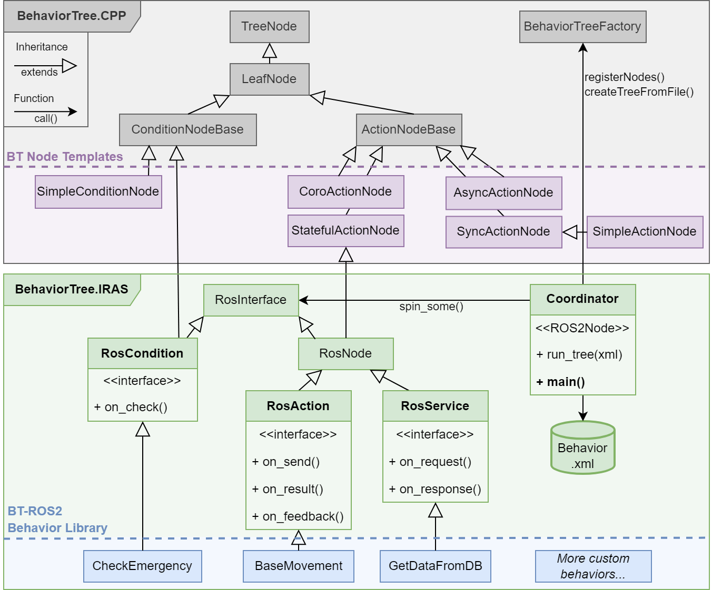
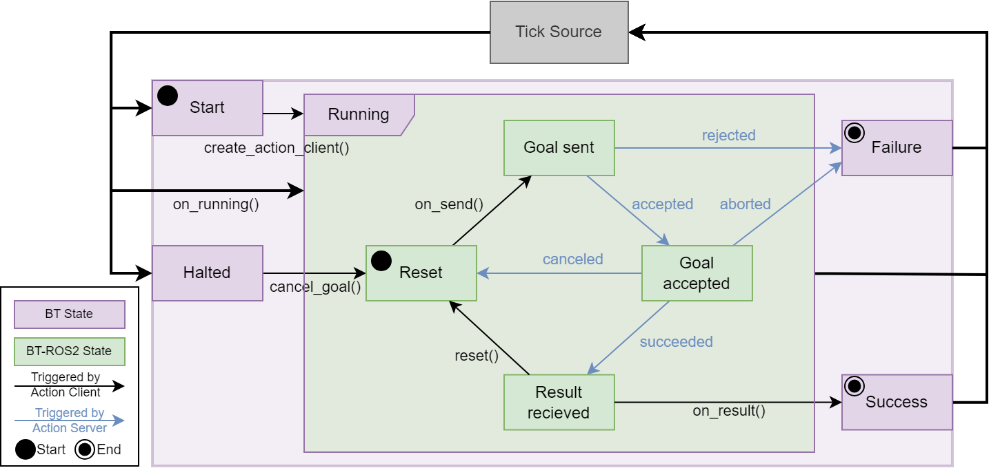

# BehaviorTree.IRAS

This package is a wrapper around the [BehaviorTree.cpp v3.8](https://www.behaviortree.dev/docs/3.8/intro) package. Developed as a general high-level task control architecture for many robotic systems in the Institute for Robotics and Autonomous Systems ([IRAS](https://www.h-ka.de/iras)) at University of Applied Sciences Karlsruhe (HKA)

It provides an easy to use API for ROS2 services and actions inside a BehaviorTree action node. Additionally it offers XML palette generation and easierer port handling.

For an example on how to set up a ROS2 project with this BT framework and create custom BT actions look at [IRAS_Coordinator](https://github.com/AndreasZachariae/iras_coordinator)

## Behavior Trees

For general informaton of the concept of Behavior Trees read the [docs](https://www.behaviortree.dev/docs/3.8/intro).

## Overview
This wrapper builds on top of the classes from BehaviorTree.cpp v3.8 and introduces new classes with integrated ROS2 support. Those include:
- **RosNode** Classic BT StatefulActionNode with access to ROS2 node handle
- **RosCondition** Classic BT ConditionNode with access to ROS2 node handle
- **RosAction** Wrapps a ROS2 action client and provides simple interface
- **RosService** Wrapps a ROS2 service client and provides simple interface

## ROS2 Integration

To integrate ROS2 clients into the BT node structure, a Hierarchical Finite State Machine (HFSM) is used. The state machine of a standard BT action is marked in purple. A single BT node is continuously ticked by the root of the tree. First, it initializes in a **Start** state and results in either **Running**, **Failure** or **Success**. The latter two are terminal states, only in the **Running** state, the node is ticked again. The method to combine the BT concept with ROS 2 functionalities builds on adding a sub-hierarchical state-machine to the **Running** state which handles the execution of the ROS 2 action client. This hierarchical level is marked in the figure below with green. This substate machine starts in the **Reset** state and firstly sends the ROS 2 action goal over the ROS 2 network to the corresponding ROS 2 action server. This action server can accept or reject the requested action goal. Depending on the answer sent back to the action client, the transition **accepted** or **rejected** is triggered and either the client continues or the whole BT action fails. All responses from the ROS 2 action server are shown as transitions in blue. Note that during the handling of the action client, the BT node is continuously ticked but remains in the **Running** state. As a result, the transitions and changes from the ROS 2 action server are only registered in the frequency of the tick source which is per default 100 Hz.

## License

 This work is licensed under a <a rel="license" href="http://creativecommons.org/licenses/by-nc/4.0/">Creative Commons Attribution-NonCommercial 4.0 International License</a>.
